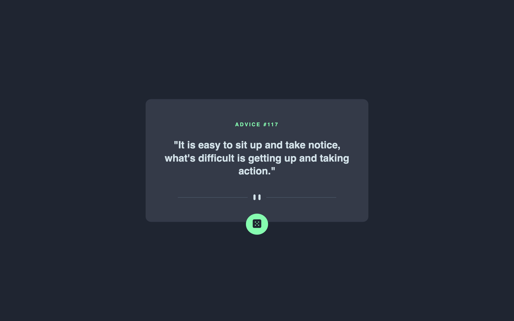

# Frontend Mentor - Advice generator app solution

This is a solution to the [Advice generator app challenge on Frontend Mentor](https://www.frontendmentor.io/challenges/advice-generator-app-QdUG-13db). Frontend Mentor challenges help you improve your coding skills by building realistic projects.

## Table of contents

- [Overview](#overview)
  - [The challenge](#the-challenge)
  - [Screenshot](#screenshot)
  - [Links](#links)
- [My process](#my-process)
  - [Built with](#built-with)
  - [Continued development](#continued-development)
  - [Useful resources](#useful-resources)
- [Author](#author)

## Overview

### The challenge

Users should be able to:

- View the optimal layout for the app depending on their device's screen size
- See hover states for all interactive elements on the page
- Generate a new piece of advice by clicking the dice icon

### Screenshot

### Links

- Solution URL: [Add solution URL here](https://github.com/habarahonaa/advice-generator)
- Live Site URL: [Add live site URL here](https://habarahonaa.github.io/advice-generator/)

## My process

### Built with

- Semantic HTML5 markup
- CSS custom properties
- CSS animations
- Flexbox
- CSS Grid
- Mobile-first workflow
- [React](https://reactjs.org/) - JS library
- [Styled Components](https://styled-components.com/) - For styles
- [Fontsource](https://fontsource.org/) - For Self-Hosted fonts

### Continued development

I dislike some things from my solution, mostly related to CSS positioning because i had to "hard-code" the width of the advice container so the button always kept its positioning even if the advice slip is longer.

### Useful resources

- [React patterns: Container Component](https://reactpatterns.com/) - This helped me to put a little bit of code design to hydrate the advice card component more neatly.

- [StackOverflow: Display SVG icons as components](https://stackoverflow.com/questions/42296499/how-to-display-svg-icons-svg-files-in-ui-using-react-component) - Tsuni pointed out to the create-react-app documentation that explains how to import an SVG file in React to use it as a component in code.

## Author

- Website - [habarahonaa.tech](https://habarahonaa.tech)
- Frontend Mentor - [@habarahonaa](https://www.frontendmentor.io/profile/habarahonaa)
- Twitter - [@habarahonaa](https://www.twitter.com/habarahonaa)
